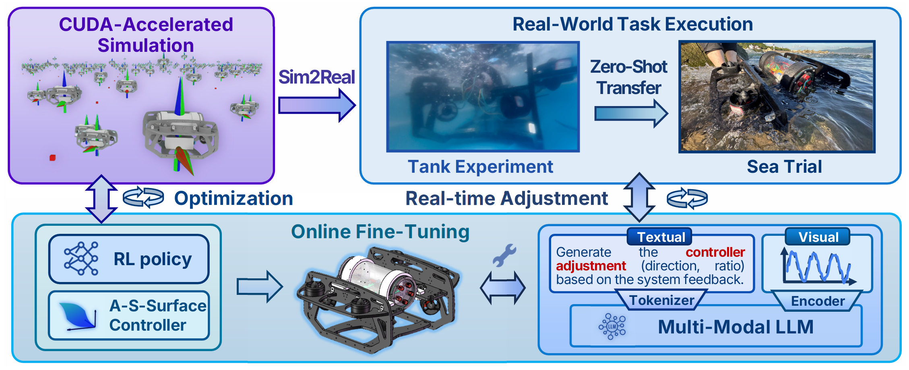

# EasyUUV-Isaac-Simulation

[](https://360zmem.github.io/easyuuv/) [](https://github.com/360ZMEM/EasyUUV-Isaac-Simulation)

This repository contains code implementation for simulator of the paper "EasyUUV: An LLM-Enhanced Universal and Lightweight Sim-to-Real Reinforcement Learning Framework for UUV Attitude Control".

The hardware deployment code repository refers to [**HERE**](https://github.com/360ZMEM/EasyUUV-UUV-Deploy)



## Simulator Deployment

### Environment Setup

This project utilizes a simulator based on Isaac Sim/Lab. The code has been tested on a system with NVIDIA GeForce RTX 4060 (requiring approximately 5600MB GPU memory for 2048 parallel environments), Ubuntu 24.04 LTS, IsaacSim v4.0.0, and IsaacLab v1.0.0 (installation instructions are provided based on this configuration). Theoretically, the code should also work with other Isaac Lab V1 versions such as IsaacSim v4.2.0 + IsaacLab v1.4.1. For migration to IsaacLab V2, please refer to [this link](https://isaac-sim.github.io/IsaacLab/main/source/refs/migration.html).

First, you should [download Isaac Sim](https://docs.isaacsim.omniverse.nvidia.com/4.5.0/installation/download.html) and confirm version 4.0.0 is selected. Next, install Isaac Lab v1.0.0 using:

```bash
git clone --branch v1.0.0 https://github.com/isaac-sim/IsaacLab.git
```

To ensure compatibility with RSL-RL, modify the file `<IsaacLab_Path>/source/extensions/omni.isaac.lab_tasks/setup.py` following [these instructions](https://github.com/isaac-sim/IsaacLab/pull/1808/files/8af43cb048cdaa976c24a0f2b569ea9e45db533d) before installation. Then follow the [Isaac Lab installation guide](https://isaac-sim.github.io/IsaacLab/v1.4.1/source/setup/installation/binaries_installation.html) to complete the setup and verify functionality through tests.

### Deployment Configuration

Create a symbolic link or copy the directory to install the reinforcement learning environment:

```bash
git clone https://github.com/360ZMEM/EasyUUV-Isaac-Simulation.git
ln -s EasyUUV-Isaac-Simulation <IsaacLab_Path>/source/extensions/omni.isaac.lab_tasks/omni/isaac/lab_tasks/direct/EasyUUV-Isaac-Simulation
```

### Training

Train using the following command (ensure correct Python environment activation and execution from IsaacLab root directory; `--headless` flag is recommended for improved performance):

```bash
./isaaclab.sh -p source/standalone/workflows/rsl_rl/train.py --task EasyUUV-Direct-v1 --num_envs 1024 --headless
```

Note that when visualization is enabled, loading USD files consumes significant memory. Therefore, if the `--headless` option is not specified, you should reduce the `--num_envs` parameter (e.g., to 512); otherwise, it may lead to excessive resource usage or crashes.

Monitor training with Tensorboard:

```bash
tensorboard --logdir <IsaacLab_Path>/logs/rsl_rl/EasyUUV-Isaac-Simulation/
```

Generated policy checkpoints can be exported to Torch JIT/ONNX formats using:

```bash
./isaaclab.sh -p <IsaacLab_Path>/source/extensions/omni.isaac.lab_tasks/omni/isaac/lab_tasks/direct/EasyUUV-Isaac-Simulation/workflows/gen_policy.py
```

Exported files will be saved at `<IsaacLab_Path>/logs/rsl_rl/EasyUUV-Isaac-Simulation/<latest_date>/exported/policy.pt` (contains both Torch JIT and ONNX formats). Load Torch JIT models with `torch.jit.load()`. Note that RSL-RL creates date-stamped folders for each training session, where `<latest_date>` represents the most recent timestamp folder.

### Evaluation

The `workflows` directory contains trajectory tracking implementations. For example:

```bash
./isaaclab.sh -p <IsaacLab_Path>/source/extensions/omni.isaac.lab_tasks/omni/isaac/lab_tasks/direct/EasyUUV-Isaac-Simulation/workflows/play_eval_task1.py
```

- `play_eval.py`: Tracks sinusoidal signals.
- `play_eval_task2.py`: Tracks irregular dynamic signals.
- `play_eval_step.py`: Tracks step signals.
- `play_controller.py`: Direct controller implementation (w/o RL).

Note: Requires prior configuration of `wandb` for real-time visualization. Also, we provide offline file for tracking result: `<IsaacLab_Path>/source/results/rsl_rl/EasyUUV-Isaac-Simulation/.*/model_.*_play/logs.csv`.

## Acknowledgement

This repository is modified based on [this codebase](https://github.com/warplab/isaac-auv-env).

# Cite

If you find it useful for your work please cite:

```bibtex
@article{xie2025easyuuv,
      title={EasyUUV: An LLM-Enhanced Universal and Lightweight Sim-to-Real Reinforcement Learning Framework for UUV Attitude Control},
      author={Xie, Guanwen and Xu, Jingzehua and Tang, Jiwei and Huang, Yubo and Zhang, Shuai and Li, Xiaofan},
      journal={arXiv preprint arXiv:2510.22126},
      year={2025}
    }
```